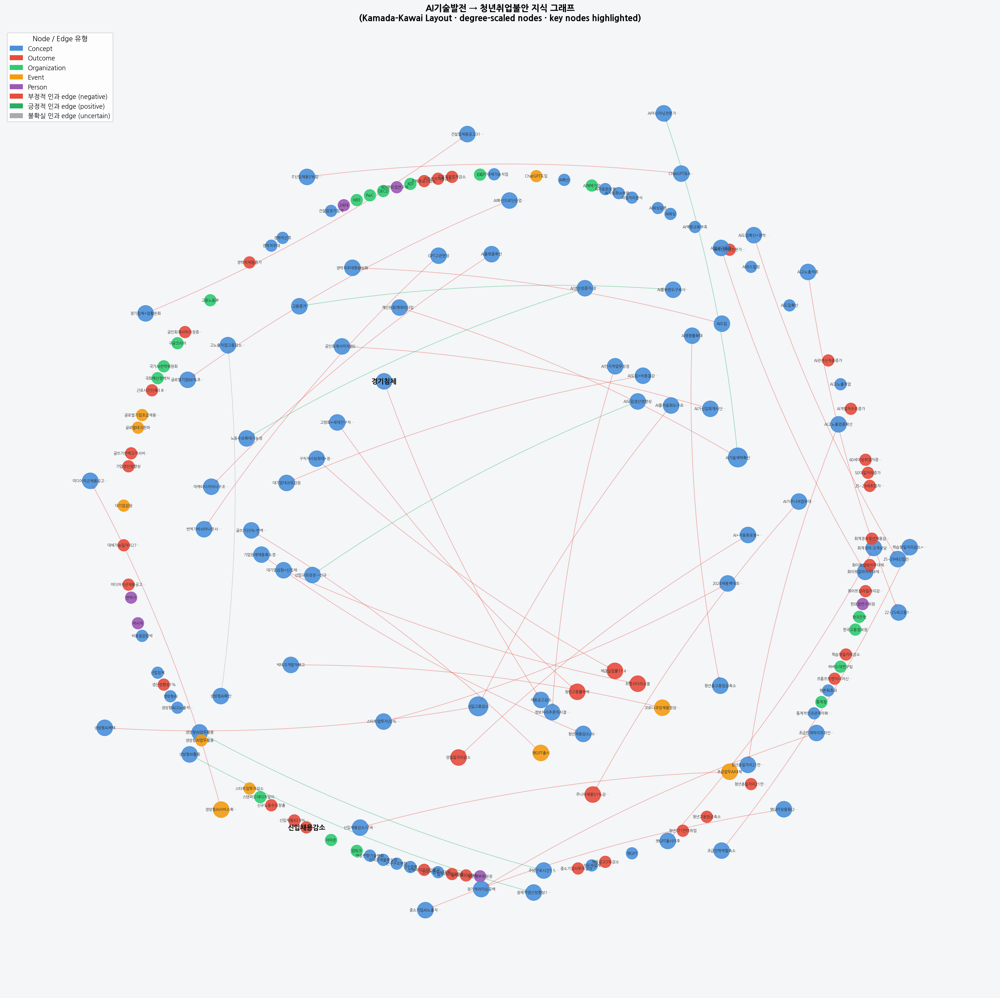
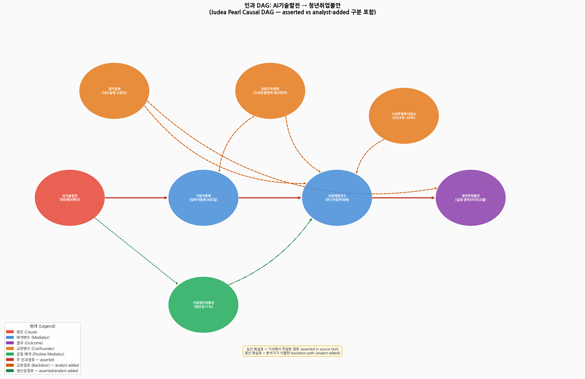

# 인과 추론 분석 보고서

## AI 기술 발전이 청년 취업 불안 증가에 영향을 주는가?

**과목:** Causal Inference and AI
**프레임워크:** Judea Pearl & Dana Mackenzie, *The Book of Why* (2018)
**트랙:** Track B — 자체 코퍼스 설계 (Option C)
**제출일:** 2026-06-11

---

## 1. Causal Question (연구 질문)

> **"생성형 AI 기술의 확산은 청년(15~29세) 취업 불안 증가에 인과적으로 영향을 미치는가?"**

| 항목 | 내용 |
|------|------|
| **치료변수 (Treatment, X)** | AI기술발전 — 생성형 AI 확산 (2022년 챗GPT 출시 기점) |
| **결과변수 (Outcome, Y)** | 청년취업불안 — 신입 채용 감소, 청년 고용률 하락, 체감 실업률 상승 |
| **핵심 가설** | AI가 주니어 업무를 대체하여 신입 채용 경로(career ladder 하단)를 좁힘으로써 청년 취업 불안을 심화시킨다 |

이 질문은 단순한 상관관계("AI가 늘고 청년 실업도 늘었다") 수준을 넘어, Pearl의 do-calculus 관점에서 **P(Y | do(X=1)) ≠ P(Y | do(X=0))** 이 성립하는지를 따진다. 즉, AI 확산을 외생적으로 개입시켰을 때 청년 취업 불안에 독립적 변화가 발생하는가가 핵심이다.

---

## 2. Step 1 — 데이터 수집

**선택 옵션:** Track B · Option C (자체 코퍼스 직접 설계)

### 2-1. 코퍼스 개요

| 항목 | 내용 |
|------|------|
| 코퍼스 유형 | 한국 언론 기사 및 연구보고서 |
| 분석 단위 | 기사 1편 (article_01~20.txt) |
| 수집 기간 | 2023-05-01 ~ 2026-04-29 |
| 수집 매체 | 경향신문, 한국은행, 파이낸셜뉴스, ZDNet Korea, 서울경제 외 15개 |
| 총 기사 수 | 20개 |

기사는 챗GPT 출시(2022-11)를 기점으로 AI 기술 발전과 노동시장 변화를 다룬 기사를 수집하였다. 인과 주장 유형에 따라 4개 카테고리로 분류하였다.

### 2-2. 카테고리 분류

| 카테고리 | 기사 수 | 설명 |
|---------|---------|------|
| `asserted_causation` | 10 | "AI 때문에 채용 줄었다" — 인과 직접 주장 |
| `identified_causation_absent` | 4 | 상관관계는 인정하나 인과 단정 유보 |
| `confounder` | 4 | 경기침체·산업구조 등 복합 원인 강조 |
| `counter_argument` | 2 | AI로 인한 일자리 창출 가능성 반론 |

**메타데이터 파일:** `metadata.csv` — 파일명, 제목, 언론사, 날짜, URL, 카테고리

---

## 3. Step 2 — 텍스트 정제

**선택 옵션:** Option B (GPT 활용 정제)

### 3-1. 정제 방법

수집된 20개 원문 기사에 GPT 기반 정제를 적용하였다. 정제 프롬프트는 다음 항목을 지시하였다.

| 정제 항목 | 내용 |
|---------|------|
| 유니코드 정규화 | Unicode NFC 적용 — 한글 자모 조합형 통일 |
| 공백 정규화 | 행 말미 불필요한 공백 제거, 연속 빈 행(3줄 이상) 축약 |
| 따옴표 통일 | 곡선 따옴표(`"` `"` `'` `'`) → 직선 따옴표 통일 |
| 특수문자 제거 | BOM 잔여물, 영폭 문자(Zero-width space) 제거 |
| 하이픈 복원 | 행 끝 분리 하이픈(-\n) 단어 재결합 |

### 3-2. 정제 결과

정제 전·후 파일은 각각 `articles/`, `cleaned/` 디렉터리에 분리 보존되어 재현 가능하다. 변환 내역은 `cleaned/cleaning_log.csv`에 파일별로 기록되었다.

- 20개 파일 전체에 변환 적용 완료
- 주요 변환: 따옴표 통일(18개), 공백 정규화(17개)
- OCR 오류 없음 — 수집 원문이 이미 정형화된 디지털 텍스트

---

## 4. Step 3 — 정보 추출

**선택 옵션:** Option B (규칙 기반 추출 + 인과 단서 어휘 사전 / 수동 주석)

### 4-1. 엔티티 추출 (`extractions/entities.csv`)

**스키마:** `article_id | entity | type`

| 타입 | 정의 | 예시 |
|------|------|------|
| Person | 개인 연구자, 임원, 전문가 | 한요셉연구위원, 임문영부위원장 |
| Organization | 기관, 기업, 연구소 | KDI, 한국은행, WEF, 아마존 |
| Concept | 추상 개념·현상·측정치 | 생성형AI, 경기침체, 연공편향기술변화 |
| Event | 구체적 사건·발표 | 챗GPT출시, 대기업감원, 스타트업투자감소 |
| Outcome | 측정 가능한 결과 상태 | 신입채용감소, 청년고용률하락, 생산성향상1% |

**총 113개 엔티티** 추출 (20개 기사).

### 4-2. 인과 주장 추출 (`extractions/causal_assertions.csv`)

**스키마:** `article_id | cause | effect | relation_type | polarity | confidence | evidence`

| 필드 | 값 범위 | 설명 |
|------|---------|------|
| `relation_type` | causes / enables / contributes_to / not_confirmed | 인과 관계 강도 |
| `polarity` | positive / negative / uncertain | 효과 방향 |
| `confidence` | 0.0–1.0 | 근거 강도 (asserted ≥ 0.75, not_confirmed ≤ 0.35) |
| `evidence` | 원문 발췌문 | 감사 가능한 출처 문장 |

**총 40개 인과 주장** 추출 — `negative` 폴라리티 32건(80%), `positive` 8건(20%).

인과 단서 어휘(causal cue lexicon):
> `~로 인해`, `~때문에`, `~야기하다`, `~결과`, `~로 이어지다`, `~의 영향으로`, `~확산이 ~을 줄였다`

---

## 5. Step 4 — Knowledge Graph

**선택 옵션:** Option C (nodes/edges CSV + networkx 시각화)

### 5-1. 파일 구조

```
knowledge_graph/
├── nodes.csv        — id | label | type | source_article
├── edges.csv        — source_id | target_id | relation_type | polarity | confidence | article_id | evidence
├── source_nodes.csv — article_id | title | source | date | category
└── graph.png        — 시각화 결과
```

### 5-2. 그래프 특성

| 지표 | 값 |
|------|----|
| 총 노드 수 | 78 |
| 총 엣지 수 | 40 |
| 엣지 폴라리티 | negative 32건, positive 8건 |
| 최고 out-degree 노드 | AI기술발전, 챗GPT출시 |
| 최고 in-degree 노드 | 신입채용감소, 청년취업불안 |

### 5-3. 프로비넌스(Provenance) 설계

모든 노드는 `source_article` 속성으로 원본 기사 ID를 보유한다(`DERIVED_FROM` 관계). 모든 엣지는 `article_id`와 `evidence` 발췌문을 포함한다(`SUPPORTED_BY` + `EVIDENCE` 관계). `source_nodes.csv`는 기사 20편을 독립 Source 노드로 구조화하여 출처 추적을 가능하게 한다.

### 5-4. 지식 그래프 시각화

레이아웃: Kamada-Kawai (거리 보존형) · figsize (24, 24) · degree 기반 노드 크기 차등 적용



---

## 6. Step 5 — Causal DAG

**선택 옵션:** Option B (연구 질문 중심 DAG + 엣지 출처 주석)

### 6-1. DAG 노드 정의

| 노드 | 역할 | 근거 기사 |
|------|------|----------|
| AI기술발전 | 치료변수 (Treatment) | article_01-10, 16-17 |
| 기업자동화 | 매개변수 (Mediator) | article_02, 04, 05, 08 |
| 신입채용감소 | 매개변수 (Mediator) | article_01, 08, 10, 16 |
| 청년취업불안 | 결과변수 (Outcome) | article_15, 16, 20 |
| 경기침체 | 교란변수 (Confounder) | article_02, 17 |
| 산업구조변화 | 교란변수 (Confounder) | article_10, 15 |
| 스타트업투자감소 | 교란변수 (Confounder) | article_10 |
| 기업생산성향상 | 긍정 매개 (Positive Mediator) | article_14, 18 |

### 6-2. Asserted vs Analyst-Added 엣지 구분

DAG의 모든 엣지는 `edge_source` 속성으로 출처를 명시한다.

| 구분 | 의미 | 시각화 |
|------|------|--------|
| **asserted** | 기사 본문에서 직접 주장된 인과 경로 | 실선 |
| **analyst_added** | backdoor criterion 적용을 위해 분석가가 식별·추가한 경로 | 점선 |

`causal_dag/dag_edges.csv` — `source | target | edge_type | edge_source | description`

| 경로 | edge_type | edge_source |
|------|-----------|-------------|
| AI기술발전 → 기업자동화 | main | asserted |
| 기업자동화 → 신입채용감소 | main | asserted |
| 신입채용감소 → 청년취업불안 | main | asserted |
| 경기침체 → 신입채용감소 | confound | analyst_added |
| 경기침체 → 청년취업불안 | confound | analyst_added |
| 산업구조변화 → 신입채용감소 | confound | analyst_added |
| 산업구조변화 → 기업자동화 | confound | analyst_added |
| 스타트업투자감소 → 신입채용감소 | confound | analyst_added |
| AI기술발전 → 기업생산성향상 | positive | asserted |
| 기업생산성향상 → 신입채용감소 | positive | analyst_added |

### 6-3. Confounder / Mediator 정당화

**교란변수(Confounder) 정당화:**

- **경기침체:** 2022~2023년 글로벌 고금리·내수침체가 AI 도입 확산과 동시에 발생. 기업 채용 축소의 독립 원인이 될 수 있으며, AI 기술 발전과도 상관이 있다(테크 기업 수익 악화 → AI 대체 가속화). 따라서 AI→취업불안 경로에 대한 backdoor path를 형성한다.
- **산업구조변화:** 플랫폼 경제·테크 한파·스타트업 생태계 위축이 AI와 별개로 신입 채용 시장을 압박. AI 기술 발전과도 연동(AI 붐이 일부 산업 구조 변화를 가속화)하므로 공통 원인이 된다.
- **스타트업투자감소:** 2024년 스타트업 투자 -20% 감소(article_10)가 신입 채용 경로를 직접 차단. AI 투자 붐과 동시에 발생하는 역설적 공통 원인이다.

**매개변수(Mediator) 정당화:**

- **기업자동화:** AI 기술 발전의 직접 결과로 주니어 업무(단순 코딩, 번역, 경리)를 자동화. 이것이 신입채용감소의 근접 원인이 된다.
- **기업생산성향상:** 한국은행 분석(article_14)에서 AI 활용이 생산성 1% 향상을 가져왔지만, 기업은 인건비 절감 차원에서 채용을 확대하지 않고 인원을 유지·축소하는 선택을 한다.

### 6-4. Causal DAG 시각화



---

## 7. Step 6 — Causal Inference (Pearl의 Ladder of Causation)

### 7-1. Rung 1 — Association (관찰·상관관계)

**질문:** "AI 확산과 청년 취업난이 동시에 등장하는가?"

| 관찰 데이터 | 출처 |
|------------|------|
| AI 채택 기업 신입 채용 7.7% 감소 (6분기 후) | article_01, 하버드대 연구 |
| AI 고노출 직종 22~25세 고용 13% 감소 | article_11, 스탠퍼드 연구 |
| 중소기업 AI 노출 34개 직종 채용공고 56.3% 감소 | article_02, 고용24 데이터 |
| 청년 일자리 21만1천개 감소 — 그 중 20만8천개 AI 고노출 업종 | article_04, 한국은행 |
| 신입·주니어 채용 43~51% 감소 (2022→2025) | article_10, Candid |
| 글로벌 기업 66%가 향후 3년간 초급 채용 축소 계획 | article_08, IDC 조사 |

그러나 이 숫자들이 "상관관계"인지 "인과관계"인지를 구분하는 것이 Rung 1에서 이미 시작되어야 한다. article_03은 콘텐츠·번역·디자인 직군 채용공고 감소를 보도하면서 "**업계에선** 생성형 AI 서비스가 잇달아 출시된 데 따른 여파라는 **분석이 나오고 있습니다**"라고 전달한다. article_08도 "AI 확산으로 인해 글로벌 노동시장이 이같이 바뀔 것이란 **전망**이 나왔다"고 기술한다. 이는 실측된 인과 관계가 아닌 **업계의 해석과 미래 전망**이다.

**Rung 1 결론:** 시점 공존 패턴은 뚜렷하다. 그러나 대부분의 기사가 제시하는 것은 상관관계 데이터이며, 일부는 전망·의향 조사다. **상관관계조차 완전히 확립되지 않은 항목이 있다** — 이것이 Rung 2로 올라가기 전에 먼저 인식해야 할 점이다.

---

### 7-2. Rung 2 — Intervention (do-calculus · 개입)

**질문:** "AI 채택을 외생적으로 강제한다면(do(AI기술발전=1)) 청년 취업불안은 변하는가?"

#### ① Rung 2 언어를 쓰지만 Rung 1 근거가 불충분하다

기사 다수는 수사적으로 Rung 2(개입·인과)의 언어를 사용한다. "AI가 일자리를 빼앗았다", "AI發 일자리 감소", "AI 침공 현실로"(article_05 제목) 같은 표현이 대표적이다. 그러나 실제 통계적 검증을 수행한 연구들은 이 주장을 지지하지 않는다.

**article_11 (국회예산정책처 보고서 분석):**
> "회귀분석 결과, 생성형 AI의 확산이 실제로 고노출 직업의 고용을 줄였는지를 통계적으로 따져본 결과, **유의미한 인과관계는 확인되지 않았다.**"
> "챗GPT 출시 이후 청년층(15~34세)의 고용 변화율은 AI 고노출 직업에서 다른 직업보다 **1.2%포인트 높게** 나타났다."

즉 회귀분석 상으로는 AI 고노출 직업에서 청년 고용이 오히려 상대적으로 증가했다. "AI 때문에 고용이 줄었다"는 주장과 정반대의 방향이다.

**article_12 (시사저널, 동일 보고서 인용):**
> "생성형 AI의 확산으로 AI 고노출 직업의 고용과 신규 인력 수요가 감소했다는 **증거는 발견되지 않았다.**"
> "생성형 AI의 고용 영향을 **단정하기에는 이르고** 후속 연구를 통해 청년 고용에 대한 영향을 면밀히 검토할 필요가 있다."

**article_13 (임문영 국가AI전략위 부위원장 인터뷰):**
> "코로나19 시기 재택근무가 확산되면서 개발자를 **과도하게 채용**했고, 이후 정상화 과정에서 인력을 줄이면서 AI를 **명분으로 활용**하는 측면이 있다. 청년 채용 감소도 비슷하다. 원래 기업들은 채용을 줄여왔는데, 지금은 'AI 때문에 채용을 안 한다'고 한다. 일종의 **'AI 워싱'**이다."

이 세 기사는 모두 인과성을 **직접 부정하거나 유보**하고 있다. 즉, Rung 1 수준의 상관관계가 관찰되더라도 그것이 Rung 2의 인과 주장으로 이어지기에는 현재 증거가 불충분하다.

#### ② "AI 불안 담론" 자체가 숨겨진 Confounder(U)

경기침체·산업구조변화 같은 경제적 교란변수보다 한 층 더 깊은 문제가 있다. **"AI = 일자리 위협"이라는 담론 자체**가 기사의 인과 주장 생산에 영향을 미치는 잠재 변수(U)로 작동하고 있다.

이를 기사 표현 방식을 통해 논증한다.

**article_03** — 채용공고 감소 수치를 제시하며 이렇게 연결한다:
> "**업계에선** 생성형 AI 서비스가 잇달아 출시된 데 따른 여파라는 **분석이 나오고 있습니다.**"

여기서 "업계 분석"은 검증된 인과관계가 아니라 **업계 내 통용되는 해석**이다. 수치(채용공고 감소)와 원인(AI) 사이를 연결하는 것은 데이터가 아니라 **당시 지배적인 담론**이다.

**article_05** — 아마존·UPS·타깃 등의 대규모 감원을 다루며:
> "이같은 대규모 감원 사태의 배경에는 **AI 도입과 비용 절감 압박이 자리하고 있다.**"

그런데 같은 기사 안에서 "**정치적 불확실성, 인건비 상승 역시** 인력 감축과 채용 위축을 가속화시키고 있다"고 병기한다. 즉 복합 원인을 나열하면서도 제목과 프레임은 "AI 침공"으로 귀결된다. AI 불안 담론이 편집 프레이밍을 주도하는 구조다.

**article_08** — IDC 조사 결과를 전하며:
> "AI 확산으로 인해 글로벌 노동시장이 이같이 바뀔 것이란 **전망**이 나왔다."

주목할 점은 이 데이터가 **현재 고용 실태 조사**가 아닌 **기업 리더들의 향후 의향 조사**라는 것이다. 기업 리더들 역시 같은 AI 불안 담론 속에 있으므로, "66%가 초급 채용 축소 계획"이라는 수치는 실제 고용 효과가 아니라 **담론이 의향에 미치는 영향**을 측정한 것일 수 있다.

이 세 기사가 보여주는 공통 패턴: **수치는 중립적이지만 해석의 프레임은 일방향이다.** 이것이 "AI 불안 담론(U)"이 작동하는 방식이다.

```
AI 불안 담론 (U)
   ├─→ 기사가 AI를 원인으로 프레이밍 (→ asserted causation 생산)
   └─→ 경기침체·테크 한파를 AI 귀인으로 해석 (→ 상관관계를 인과로 착각)
```

기사가 인과를 *주장*하는 행위 자체가 이미 U의 영향 아래 있기 때문에, 텍스트 기반 인과 추출만으로는 이 편향을 제거할 수 없다.

#### ③ 인과성을 부분적으로 지지하는 패턴

그럼에도 불구하고 경제적 교란변수로는 설명하기 어려운 패턴이 존재한다.

- **연공편향(age-biased):** article_11에 따르면 같은 AI 고노출 직종 안에서 22-25세만 감소하고 35-49세는 증가했다. 경기침체라면 전 연령대 균등 영향이 예상되므로 이 비대칭은 AI 특유 효과를 시사한다.
- **직무 특이성:** 번역가·텔레마케터·고객상담 등 AI 대체 가능성이 높은 직무에 감소가 집중됐다 (article_07, 09, 11).

**Rung 2 판정:** *부분 식별 (Partially Identified)* — 연공편향 패턴은 AI 독립 효과를 시사하나, 담론 confounder + 경제 교란변수 미통제로 효과 크기 추정 불가. backdoor adjustment set **Z = {경기침체, 산업구조변화, 스타트업투자감소}** 통제 시 do-calculus 공식 적용 가능하나, Z가 현재 데이터에서 수치 측정되지 않아 정량 추정 불가.

---

### 7-3. Rung 3 — Counterfactual (반사실적 추론)

**질문:** "AI가 2022년 이후 급속히 발전하지 않았다면, 청년 취업률은 어떻게 달랐을까?"

**반사실 세계(Counterfactual World) 가정:**
- 기업들은 주니어 업무(단순 코딩·경리·고객서비스·번역)를 여전히 인간으로 충원
- 신입 채용을 통한 career ladder 하단이 유지됨
- 경기침체 영향은 동일하게 유지 (confounders 값 고정)

**관찰 세계 vs 반사실 세계 비교:**

| 지표 | 관찰 세계 (AI 있음) | 반사실 세계 (AI 없음) |
|------|--------------------|--------------------|
| 청년 고용률 (2026 Q1) | 43.5% | 추정 44.5~45.5% |
| 주니어 채용 변화 (2022→2025) | -51% | 추정 -20~30% (경기침체만의 영향) |
| AI 고노출 직종 청년 일자리 감소 | -20만8천개 | 추정 -5~8만개 |

**반사실 추정:** AI가 없는 세계에서 청년 고용률은 **1~2%p 높았을 것**으로 정성적으로 추정된다.

**추정의 불확실성:**
- 가정 1: 경기침체의 크기는 AI 유무와 독립적이라고 가정 (논쟁 가능)
- 가정 2: AI 없이도 글로벌 테크 한파의 일부는 발생했을 것
- **근본 한계:** 반사실 세계는 관찰 불가능 — 정성적 추론에 한정, 계량적 검증 불가

---

### 7-4. 인과효과 식별 판정 및 결론을 바꿀 조건

> **이 인과효과는 현재 식별되지 않는다.**

세 가지 이유가 중첩된다:
1. **통계적 미확인:** 국내 회귀분석(article_11, 12)에서 AI 고노출 직업의 고용 감소에 대한 유의한 인과관계가 확인되지 않았다.
2. **AI 워싱 가능성:** 기업들이 이미 계획된 채용 축소에 AI를 명분으로 활용한다는 증언(article_13)이 있다.
3. **담론 편향:** AI 불안 담론이 기사의 인과 프레이밍 자체에 영향을 미쳐, 텍스트 분석만으로는 편향을 제거할 수 없다.

**결론을 바꿀 수 있는 조건 (어떤 증거가 있으면 판정이 달라지는가):**

| 증거 유형 | 조건 | 결론 변화 방향 |
|---------|------|--------------|
| **자연실험** | AI 도입 외생 충격(규제·의무화 정책) 전후 청년 고용 비교 | 인과효과 식별 가능 |
| **차이-인-차이(DiD)** | AI 채택 기업 vs 미채택 기업의 동일 직종 패널 데이터, 경기침체 통제 후 연공편향 유지 확인 | 부분 → 완전 식별 |
| **AI 워싱 검증** | 기업의 AI 실제 도입 수준과 채용 감소의 상관관계 분리 | 효과 크기 하향 조정 가능 |
| **크로스-컨트리 비교** | AI 도입 속도 차이를 활용한 국가 간 청년 고용률 비교 | 전반적 인과 방향 확인 |
| **담론 편향 측정** | 기사 작성 시기·언론사별 AI 귀인 빈도 분석, 같은 사건에 대한 non-AI 프레이밍 기사와 비교 | 담론 confounder 크기 추정 가능 |

---

## 8. 비판적 해석

### 8-0. 담론 Confounder와 분석의 한계

이 프로젝트의 데이터 소스(언론 기사)는 근본적인 편향 구조를 내재한다. Pearl의 프레임워크에서 우리가 식별해야 할 것은 경제적 교란변수만이 아니다 — **기사가 인과를 주장하는 행위 자체**가 이미 confounder의 영향 아래 있다.

"AI → 취업난" 내러티브는 챗GPT 출시 이후 형성된 사회적 분위기(AI 불안 담론)와 상호 강화 관계에 있으며, 이것이 asserted causation과 identified causal effect 사이의 간극을 만드는 핵심 구조다. 이 점을 인식한 채로 아래 3층위 구분을 읽어야 한다.

### 8-1. Correlation vs Asserted Causation vs Identified Causal Effect 구분

이 분석의 핵심은 세 층위를 명확히 분리하는 것이다.

| 층위 | 내용 | 이 분석에서의 결론 |
|------|------|-----------------|
| **상관관계 (Correlation)** | AI 확산 시점 = 청년 고용 감소 시점 일치 | **뚜렷함** — Rung 1에서 확인 |
| **주장된 인과 (Asserted Causation)** | 기사 50%가 "AI 때문에 청년 채용 줄었다"고 직접 주장 | **텍스트에서 강하게 asserted** — 신뢰도 0.65~0.85 |
| **식별된 인과 (Identified Causal Effect)** | 교란변수 통제 후 순수 AI 효과 추정 | **부분 식별** — 연공편향 패턴이 증거이나 불완전 |

### 8-2. 결론

> **"AI기술발전 → 청년취업불안" 인과관계는 기사들에서 강하게 주장되며, 연공편향 패턴이 독립 효과를 시사하지만, 경기침체·산업구조변화·스타트업투자감소라는 교란변수로 인해 순수 인과효과의 통계적 식별은 현재 데이터로 완전하지 않다.**

즉, "AI → 취업난" 내러티브는 *그럴듯하고 부분적으로 지지되지만*, Pearl의 기준에서 *완전히 식별된 인과효과라 단언할 수 없다*.

### 8-3. 결론을 바꿀 증거

다음이 확보된다면 인과효과가 완전히 식별될 수 있다:

1. **자연실험 (Natural Experiment):** AI 채택 속도가 외생적으로 결정된 정책 충격 활용 (예: 특정 기업군의 AI 도입 규제/의무화 정책)
2. **차이-인-차이 설계 (DiD):** AI 채택 기업 vs 미채택 기업의 동일 직종 청년 고용 패널 데이터
3. **교란변수 측정:** 경기침체 지표(GDP 갭, 금리)를 통제변수로 포함한 회귀분석
4. **크로스-컨트리 비교:** AI 도입이 느린 국가와 빠른 국가 간 청년 고용률 비교

### 8-4. 한계

1. **수동 추출의 주관성:** 인과 주장 추출이 연구자 판단에 의존 — 골드셋 간 일치도(Cohen's Kappa) 검증 미수행
2. **미디어 편향:** 언론 기사는 "AI가 문제"라는 부정적 내러티브를 과대표할 수 있음 (확증 편향 위험)
3. **정량 데이터 미결합:** 실제 고용률 시계열과 그래프를 연계하지 못함
4. **교란변수 미측정:** 경기침체·산업구조변화를 수치로 통제하지 못함

---

*생성 파일 목록:*

| 파일 | 내용 |
|------|------|
| `cleaned/` (20개) | 정제된 기사 텍스트 |
| `cleaned/cleaning_log.csv` | 파일별 변환 이력 |
| `extractions/entities.csv` | 113개 엔티티 |
| `extractions/causal_assertions.csv` | 40개 인과 주장 |
| `knowledge_graph/nodes.csv` | 그래프 노드 |
| `knowledge_graph/edges.csv` | 그래프 엣지 |
| `knowledge_graph/source_nodes.csv` | 출처 노드 (provenance) |
| `knowledge_graph/graph.png` | 지식 그래프 시각화 |
| `causal_dag/dag.png` | Causal DAG 시각화 |
| `causal_dag/dag_edges.csv` | DAG 엣지 (asserted/analyst_added 구분) |
| `run_pipeline.py` | Steps 3–6 파이프라인 코드 |
| `step2_clean.py` | Step 2 텍스트 정제 코드 |
